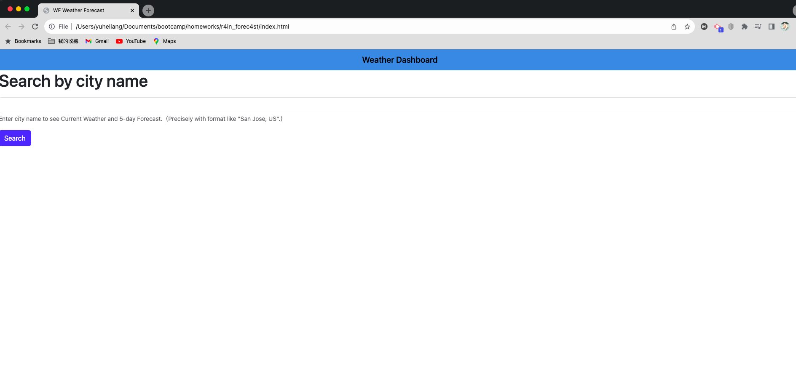
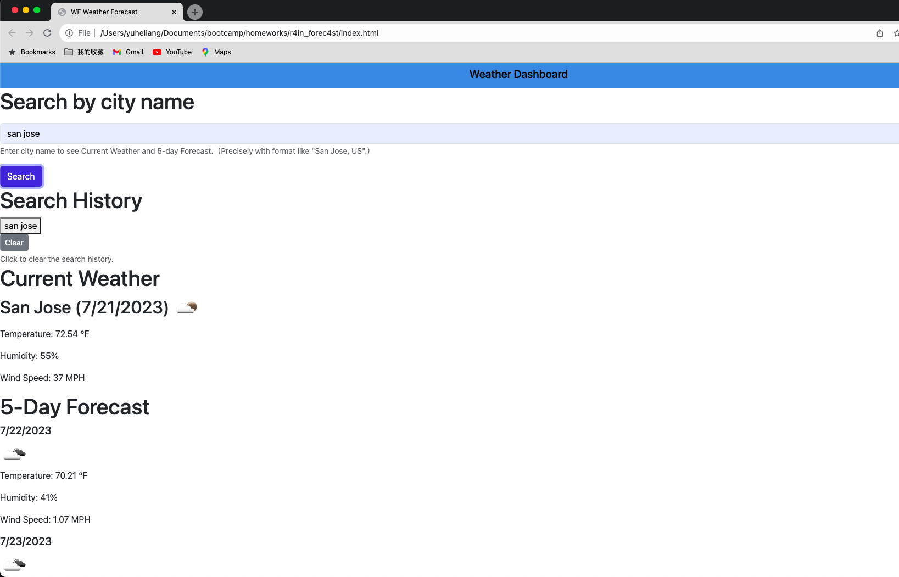

# r4in_forec4st

## Description

A weather forecast web app that uses OpenWeatherMap's Weather API.

## Table of Contents

- [Contributing](#contributing)
- [Tests](#tests)
- [License](#license)
- [Questions](#questions)
- [Deployed Application](#deployed-application)

## Contributing

OPEN-SOURCE

## Tests

N/A

## License

This project is licensed under the MIT license. Click the badge at the top of the README to learn more about the license terms and conditions.

## Questions

If you have any questions about this project, please contact me via:

- Email: yuhe.liang@outlook.com
- GitHub: https://github.com/Wallacethewonderer

## Deployed Application

https://wallacethewonderer.github.io/r4in_forec4st/

